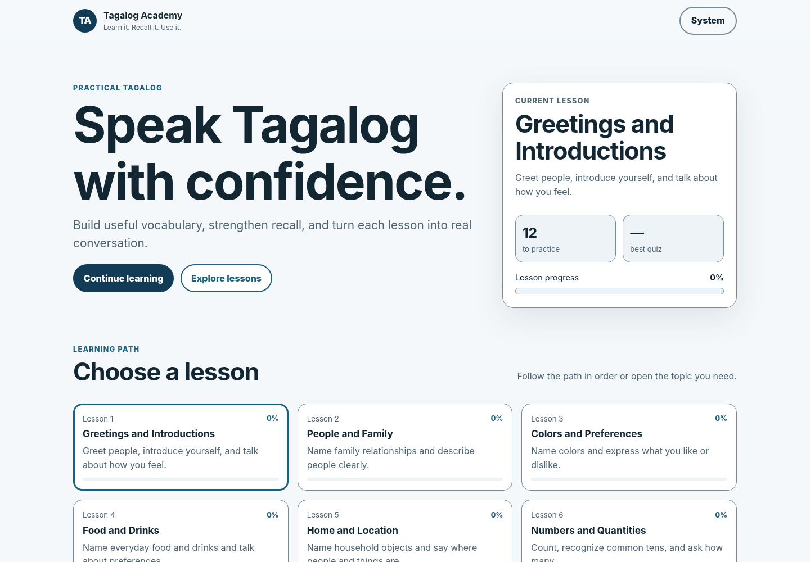

# Tagalog Academy

**Practical Tagalog in one focused learning path.**

[Open Tagalog Academy](https://tagalog.academy)



Tagalog Academy helps learners build useful vocabulary, strengthen recall, speak aloud, and use Tagalog in everyday situations.

**Learn → Recall → Speak → Use**

## Learning path

1. Greetings and Introductions
2. People and Family
3. Colors and Preferences
4. Food and Drinks
5. Home and Location
6. Numbers and Quantities
7. Fruit and the Market
8. Days and Time
9. Daily Routine

The Academy includes 246 machine-readable words, phrases, questions, and complete sentences. Each practice record has one canonical Tagalog form, an English meaning, deterministic exercise wording, accepted recall forms, usage type, register, and a concise explanation.

## Learner experience

- Short, topic-based lessons
- Searchable vocabulary and language patterns
- Listen-and-repeat controls
- Typed recall and spaced review
- Deterministic generated quizzes
- Sentence and dialogue builders
- Practical speaking activities
- Visible progress and a clear next action
- Browser-saved progress with export and import
- Beginner guide, practice pack, and answer guide
- Installable and offline-capable web app

No account is required. Progress remains in the learner's browser.

## Run locally

```bash
python tagalog.py serve
```

Open `http://127.0.0.1:8000`.

The site must be served over HTTP because it loads structured lesson data.

## Validate

```bash
python -m pip install -r requirements-dev.txt
python tagalog.py validate
node --check assets/js/theme.js
node --check assets/js/core.js
node --check assets/js/app.js
node --check service-worker.js
node tests/test_core.mjs
node tests/test_service_worker.mjs
```

GitHub Actions applies the same validation before publishing the site.

## Repository structure

```text
index.html                         Learner interface
privacy.html                       Public privacy page
language-notes.html                Public language guide
content-use.html                   Public content-use terms
404.html                           Themed not-found page
assets/css/styles.css              Responsive design system
assets/js/theme.js                 Early system-theme selection
assets/js/core.js                  Tested learning and progress logic
assets/js/app.js                   Browser interaction layer
data/catalog.json                  Ordered learning path
data/lessons/*.json                Machine-readable lessons
data/lesson.schema.json            Lesson contract
service-worker.js                  Offline shell and fresh lesson data
downloads/                         Printable learning set
scripts/                           Validation, site build, and document generation
tests/                             Content, accessibility, CLI, and logic tests
.github/                           CI, Pages deployment, ownership, and contribution forms
```

## Language standards

The Academy uses one canonical teaching form per record, labels register and usage differences, keeps recall answers deterministic, and documents accepted alternatives. Evidence-based corrections from qualified speakers and educators are welcomed through the structured language-correction process. See `LANGUAGE-GUIDE.md`.

## Contributing

Use the structured issue forms for software bugs, language corrections, and content-use concerns. Security vulnerabilities must be reported privately as described in `SECURITY.md`.

Changes should be proposed through a branch and pull request with green validation. See `CONTRIBUTING.md`.

## Licensing

- Software: MIT License
- Educational content: separate content-use terms in `CONTENT-LICENSE.md`
